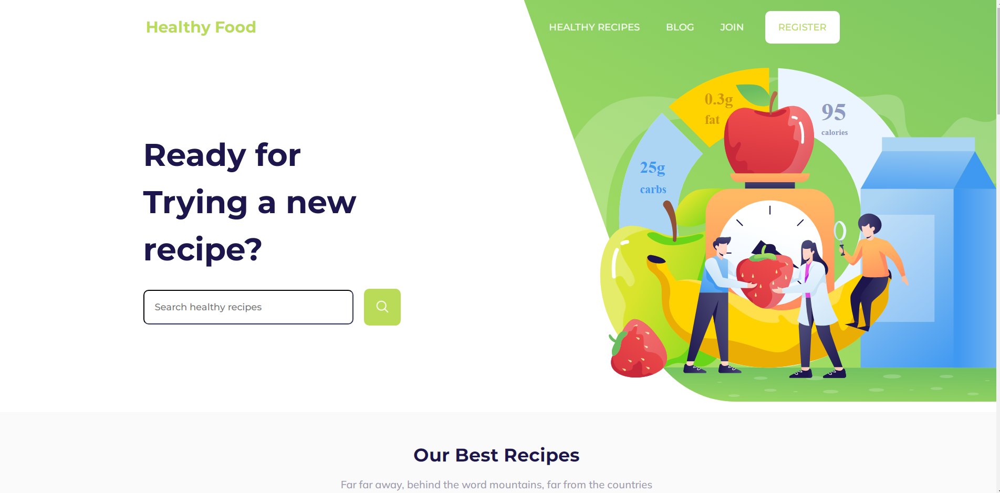

<h1 align="center"> Healthy Food </h1>

<div align="center">
    
</div>


## Descrição

Criação de uma Landing Page atrativa para os usuários, Além de um menu hambúrguer para a versão mobile e carrosel de imagens para exibição das ultimas postagens no blog estático. A mesma foi desenvolvida baseado no layout que foi disponibilizado por uma empresa com objetivo de teste pratico de habilidades para uma vaga de desenvolvedor front-end. 

## Desafio proposto

os usuários devem ser capazes de:

* Visualize o layout ideal para o site, dependendo do tamanho da tela do dispositivo

## Construído com

* [React](https://www.w3schools.com/REACT/DEFAULT.ASP) - O React é uma biblioteca JavaScript de código aberto com foco em criar interfaces de usuário em páginas web. É mantido pelo Facebook, Instagram, outras empresas e uma comunidade de desenvolvedores individuais. É utilizado nos sites da Netflix, Imgur, Feedly, Airbnb, SeatGeek, HelloSign, Walmart e outros.

## Instalação Local

Para executar esse projeto você precisara do [Node](https://nodejs.org/en/).

Por meio dele sera baixado todas as depedencias do projeto, depois de instalado execute os comandos abaixo na linha do terminal.

1) Faça o clone do projeto

```bash
    git clone git@github.com:Cesar959/healthy-food.git
```

2) para baixa todas as dependencias do projeto

```bash  
npm install
```

3) Execute o comando abaixo no terminal

```bash 
npm run dev
```

4) Acesse "http://localhost:3000/

## Status do Projeto

**Concluido**: O projeto esta terminado, não havera futuras alterações de funcionalidade.

## Autor

* **Cesar dos Santos de Almeida** - *responsável pela construção e desenvolvimento do projeto*

## Licença
Este projeto está licenciado sob a licença MIT - consulte o arquivo  [LICENSE.md](LICENSE.md) para obter detalhes


## Links
*  Não foi possivel disponibilizar um clone devidoa um prolema incomum no servidor


